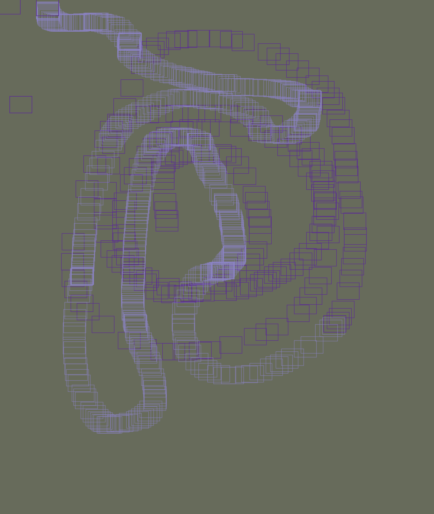

In this first week of the programming course I have made something rather "simple". My first thought of trying out p5.js was that it was quite easy to begin with. I'm not sure wheather the program language is the easier part or the instructions made by Shiffman on Youtube. Anyway, my first impression was that this language will be fast to learn - and fun aswell. 

In this first project my focus has been on modifying and combining different elements. 
These elements consisted of a mouse tracker, rectangles and playing aroung with transparancy. 

Regarding coding as a general literacy, then it is much more difficult syntax wise. This is the main difference for me. I have some experience with coding. I have tried both html and css. Both has been hard to learn because of the syntax that you have to obey when coding. If not, you won't get the result that you wanted. 
Having this coding practice makes a lot sense to me when thinking of Digital Design. Not only we get the experience of coding, but we also get the chance of visualising the ideas that might come up later on at this course. All in all I'm really looking forward to be learning more as the weeks goes by.

Here is a screenshot of the program:

And the link to try it out.
https://rawgit.com/JonasNordberg/mini_ex/master/mini_ex1/empty-example/index.html

Enjoy!

