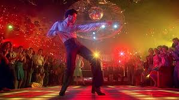

What is fun to me? 

When I asked myself this question I had a lot of answers. First of all my notion of fun doesn't have to be humour. It can be the small and simple things. A good relaxing evening with a good movie could be fun to me. 

Dancing is fun, and Saturday Night Fever is fun. So why not create a program to honor John Travolta and his dance moves? 
With this program I have tried to put in my thoughts of fun. 
Turn up the volume and enjoy a dancing square, or a dancefloor - it's up to you.
Tryout the program here: https://rawgit.com/JonasNordberg/mini_ex/master/mini_ex2/empty-example/index.html

The program it self is based upon the rectangle. First I tried the code line to create unlimited shapes instead of writing 50 lines of code (you'll see that in line 26-27). After I did this I sort of got an idea. This could be a dance floor. So I added the random variable to the colors green and blue, and kept red at 0. This way I think I made the most "pleasing" color spectre. 
After I made this site with the "dance floor" I wanted to create a spotlight which would follow the mouse across the screen, but after I made that, I decided to tryout something differently. So I created a solo dance brick in the center of the screen. 
Then I got to the music part. What song would be the perfect "hit" for aa 80's dancefloor? So obviously I chose Night Fever by Bee Gees. 
I wanted the song to load immediately after the page was opened, so I created a preload function and loaded the song. After this I had to make sure that Atom would know this code so I added the script for the index.html file so that it would know the p5.sound libary. 
After this I wanted the bricks to move, so I added the p5.Amplitude(); and made sure that the sizes of the bricks would move to the beat of the music.
One thing that I would have liked to be able to, was to be able to rotate the brick like a disco ball, but I couldn't really find out to do so, without making a WEBML, so that my text wouldn't be initialized. So I do not know if this is even possible, but I will try to find out till next week.
I hope you enjoy this program :)
