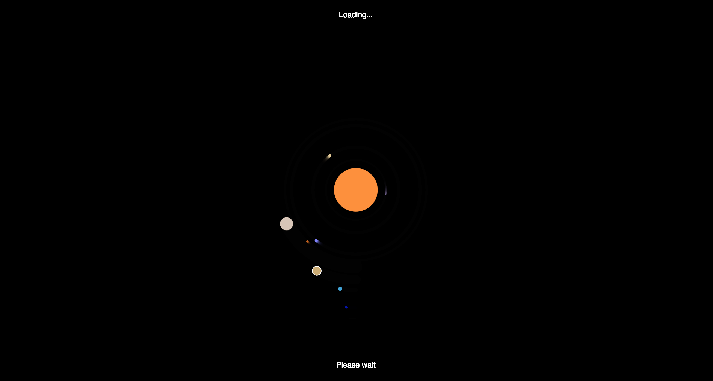

# Time

## What is time to me? 
Time is a funny concept. It is something made up logically by us humans, where we’ve created a measurement to measure the days and the years. 
But these measurements does only fit the orbital period of the earth. What if you took Neptune, the fattest know planet from the Sun in the Solar System? The orbital period is 164,8 Earth years, but in reality it is just one Neptune year. This year on Neptune consists of 60.182  Earth days, which only takes 16 hours 6 minutes and 36 seconds in relativity to the measurement of time as we know.

But in reality, time is just a product of speed. What ever we can see with our eyes is the light bouncing back to you. This seems like it is happening immediately, but in fact, this just happens because of the speed of light. So in theory, if you could travel faster than the speed of light you would really travel in time. Lets say you could go 3 times the speed of light, there would be a split second, where you could see yourself before taking of. And to make this even more Interstellar-is, then time is also manipulated by the gravitational pull. Lets say I had an identical twin and went on a spacetrip for a couple of years. If I then come back my twin would quite possibly be older than me. If you left earth and floated in space, time wouldn't move noticeably faster for you compared to everyone on Earth since the gravity on earth is too weak. If you were near a super massive black hole however, the gravity could be strong enough that an hour to you might be years to someone on Earth.
It's important to note that time dilation is only relative to other frames of reference. You could travel as fast as you'd like or as close to a black hole as you want, time to you will still feel like it's passing normally. It's only if you compared your clock to the clock of someone who wasn't moving fast relative to you or who wasn't near the black hole that you'd see that more time had passed on their clock than on yours. 
Okay, okay, back on track. 
So in real life you see time in minutes, days, years etc. But what about online? Does time even exist? 
Whenever you go online everything is available, there are no sites that are online up and running during the day. 
Some support webpages even provides 24h support. So when do we even stumble upon this phenomenon online? 
To me it happens in the waiting periode. When the stream doesn’t go as fast as I want it to do. And this is when the infamous throbber comes in to the picture. This small icon is the only reminder, besides the clock on your computer, of time.

### The program
So when assigned this task, of creating something regarding time, this was the first thing that popped in to my mind, so what I wanted to create, was a throbber, which resembled this relativity of time, so whats better than the great universe, which can provide all answers to us? Therefore I created our solar system with the sun in the middle and then our flat-Earth (joke) as the third planet circling the Sun. 
All the planets are moving with a speed that is true related to the earths orbital period. which has been set to 1000. 
Mercurys orbital period takes 0.24 earth years, so therefore I have multiplied this number with 1000, so that it would represent the actual speed in relation to the earths period, which is 1. I could have just created the throbber with the actual value, but it would take a year, to complete one round then… 
I have done the same all up til the last “planet” in our solars system: Pluto. Pluto has an orbital period of 248 years, so this has also been multiplied with a thousand. Therefore you will see the value planet(248000, 300, 2, '#bcbab1'); for Pluto. Even though Pluto isn’t an actual planet I’ve decided to 

One thing i did have trouble creating was the ring around Saturn. I couldn’t quite manage to create a ring going around with some air between, so if you [the reader] has a solution for this I am open ears. 
Here is a screenshot of the program:

Thank you for reading through this essay. 
I hope all these numbers didn’t put you off reading this, so as a reward for reading all this, here is a space potato:

