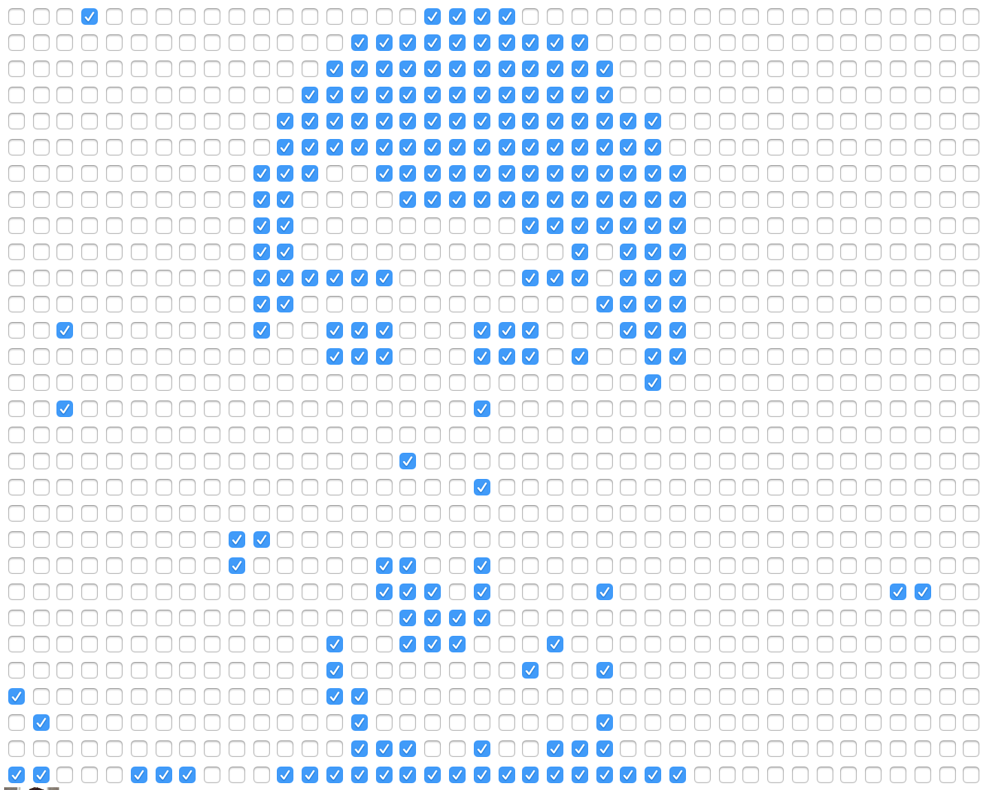

# Video Capture

So this is a bit fast one for me (didn't have so much time this week due to a new job and such things...) 
But anyway, I'm quite pleased with the result from this excercise. 

It is quite funny how it is possible to use the computers camera to track your face and then create something using this. 
So what I've done is that I've created a checkbox tracker. So whenever the persons face is moving across the screen 
a checkbox is either deemed true or false, creating a low res pixelated video of yourself.

Here is a screenshot:
 

And a link: 
https://rawgit.com/JonasNordberg/mini_ex/master/mini_ex4/empty-example/index.html

Again, this isn't as reflecting a story as I possibly could have made, but anyhow I made this program, and hopefully it is good enough.

Have a good one! 
