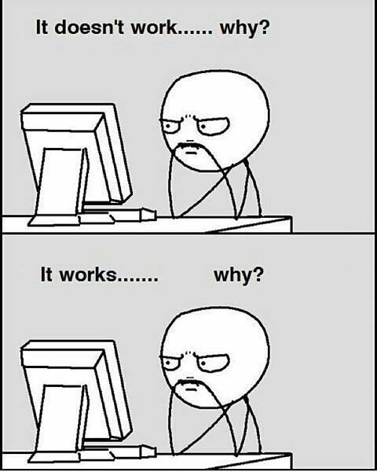

### My mini_ex5

This weeks theme was classes and games. Unfortunately I didn't quite manage to create a game which the user can interact with, since I chose to focus on the classes and creating objects in the OOP. And when I focused on this I didn't have the imagination to create something with p5.play. 
So... This is how I've experienced working with classes and OOP:

 

But anyway, what I've created is something regarding classes and objects. When thinking of classes it is actually quite surprising that as a developer you suddently has to be very subjective in your designing. The creator puts in his/hers beliefs on how reality is, which can put some people into specific boxes and roles based on their appearance or sex. 
And when you then think of all the major web-companies in the world is quite male-dominated in terms of developing software, then it becomes a problem. 
I'm not saying that I have the perfect solution, but when having such a resposibility, it should be a 50/50% workplace with women and men, and not just white males choosing what boxes people and views should be put into. 
We live in a world that has been dominated by a small number of people for a long time, but the last decade has really challenged the old "habits". In Denmark we've had the first female prime minister ever. More and more women around the world gets the good jobs and take in the big checks every month, but there is still a long way. 
One daily reminder of seperation between man and woman lies within our language. Sentences like "Man Up" or "act like a girl" is based on some 19th century thoughts on how you should act and behave. And this is just one out of hundred examples I could give.
But when you speak up against these things you can be a part of the change. 

And as I wanted to show with my program, then we can all do something. We can effect others no matter how small we are.

### The Program
Link to my program: https://rawgit.com/JonasNordberg/mini_ex/master/mini_ex5/empty-example/index.html

The program itself is created around the class I've called bubbles. The bubbles is created using a loop, so that I can create and infinite amount of bubbles based on the value I put in. In this case I chose 200 since that was what I found the most pleasing number to watch. 
The movement of these is created using a random generated speed. This creates this kind of jittering. 

When the bubbles "collides" they will be deemed "true" as if you've ticked of a box (as in my last weeks program), and change colour.

I hope this program is okay, even though I didn't quite manage to create a game. I tried making flappybird, but I couldn't figure out how to use the classes funtion within this. 

// Jonas 
