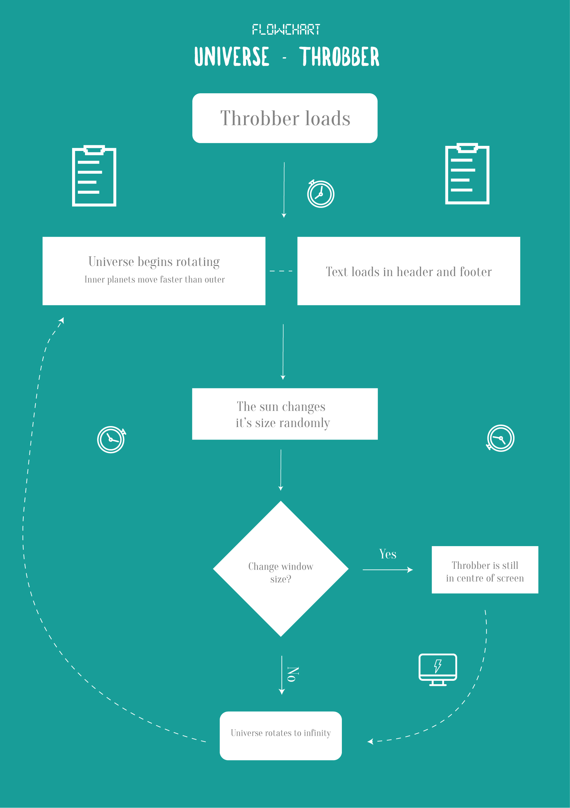
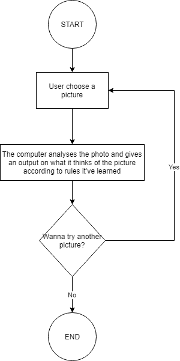

## Mini_ex9

### Individual work:

 

[link to program](https://rawgit.com/JonasNordberg/mini_ex/master/mini_ex3/empty-example/index.html)

### Group work 

### Present two different ideas with two different flow charts (it is important to think about the balance between simplicity and complexity. How can we get a sense of what's your program about?) What might be the possible technical challenges for the two ideas and how are you going to solve them?

### Project 1: Captcha
We are going create our own Captcha-program. The Captcha tries to figure whether the user of a certain program is a human or not. This is to avoid spamming or viruses in the program. The Captcha will for example ask you to write down a couple of letters to confirm your humanity. Our hope is to create an unreasonable Captcha with several levels to achieve. The levels could require to make use of sight and hearing senses or intelligence skills. The point is to make it difficult for the user to attain accessibility to the program in the end. This is to show how natural language and code/machine language differentiate from each other. The goal is in the end to show the differences between human-thinking and computational-thinking inspired by The Turing Test.

 

### Challenges: 
It may be difficult to develop a leveling program and to sort out different lines of code to not interact with each other. But this could be overcomed by organizing and folding.
Some higher level captchas might be hard to program. But our initial idea do not include any of those.
It might be difficult to 1) make the program easy to navigate in and 2) the code itself readable. We fear that this idea might require a lot of variables to check different states of the program.
To make it interesting. Do we need some kind of randomness in challenges given? different puzzles to each level? 

### Project 2: Art Investigator (AI)
This program is trained to analyze pictures through machine learning. It analyzes the pictures according to colors, vividness, shapes and so on… We do expect it to fail at some photos. For example with a photo of a burning house, the program would probably say that it’s a beautiful photo because of it’s vivid colors and brightness. 
The concept behind the program is to show how we humans try to teach the program about semantics, but in a logical way so that the machine can understand because machines are based on algorithms. When teaching other humans about art and semantics we only need to use words to describe and express our feelings. This question whether or not it’s ever going to be possible for computers to “have feelings” and be able to judge subjectively like we do. And also questions about how we should teach AI, how much we should expect from it and most importantly - why do we expect it to be as human as possible, to which goals are we striving to achieve from it?

 

### Challenges:
How do we teach the computer which picture is the most beautiful one? 
The technical aspect of making the browser analyse a set of photos in relation of how much blues ex. the photo is made of, does seem like a hard thing to do. But it is a thing we think we are capable of making, but it would take some time. To make the computer able to determine itself we need to make some kind of RGB or HSV checking on pixels. Otherwise we would have to give each picture a predetermined value.
Another thing worth thinking of, is to choose how many pictures we want the user to be able to choose from - and what this does to the program.
Do we want the user to be able to upload their own photo, and make the computer analyze the data? Or should we just put in 10 available images, that we have made the computer analyze beforehand? 

### Individual: How is this flow chart different from the one that you had in #2 (in terms of the role of a flow chart)?

### Individual: If you have to bring the concept of algorithms from flow charts to a wider cultural context, how would you reflect the notion of algorithms? (see if you could refer to the text and articulate your thoughts?)
